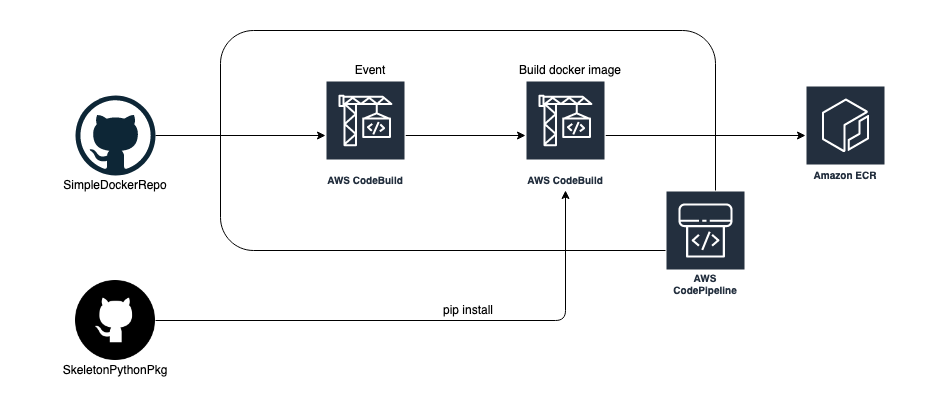

# Docker build pipeline

This CDK project builds a Docker image on AWS. It uses these two packages

- [SimpleDockerRepo](https://github.com/alexhnguyen/SimpleDockerRepo)
- [SkeletonPythonPkg](https://github.com/alexhnguyen/SkeletonPythonPkg)

Whenever the Github project `SimpleDockerRepo` is updated, the first AWS Code
Build is triggered, informing us we need to do some other action.

Afterwards, the second Code Build gets triggered. The second Code Build creates
the Docker image, and performs tasks like installing Python packages.

Once the Docker image is built, AWS Code Build pushes it to ECR for consumption.

---

Inspired from https://mlops-and-integrations.workshop.aws/cicd/run_pipeline.html

Unfortunately that is only written in CloudFormation. This project switches it
to use CDK.
